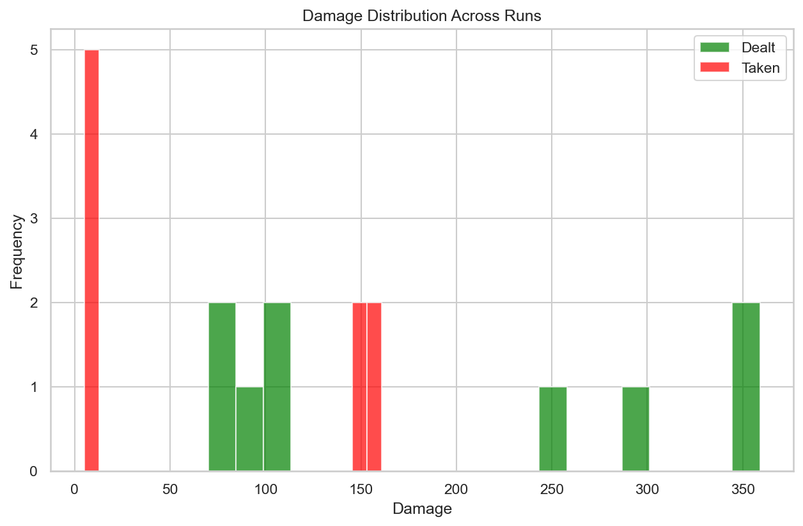
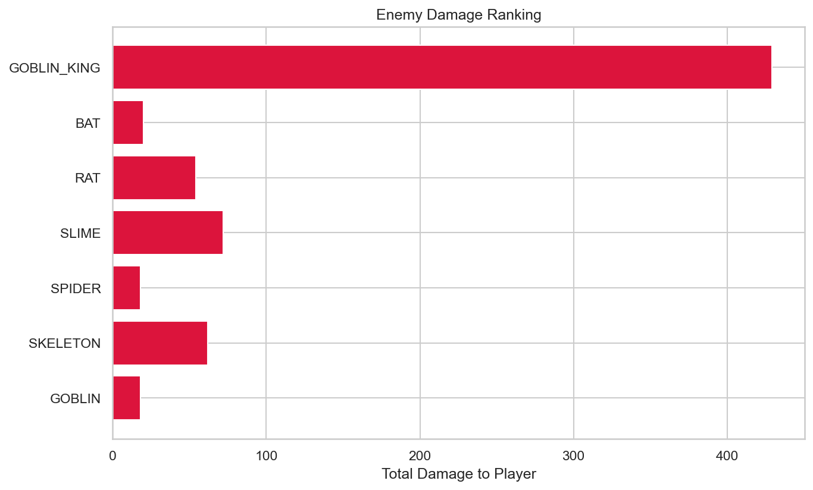
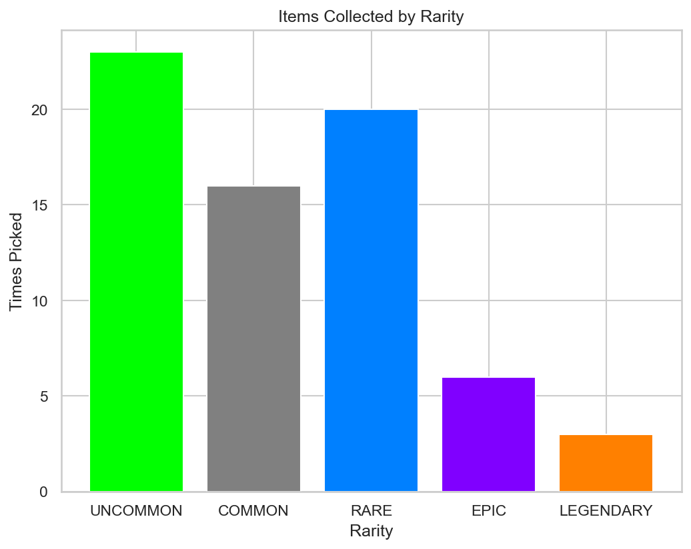

# RogueLab Batch Analysis Report

## Overview

| Metric | Value |
|--------|-------|
| Total Runs | 9 |
| Victories | 5 (55.6%) |
| Defeats | 4 (44.4%) |

## Combat Statistics

| Metric | Value |
|--------|-------|
| Total Combats | 67 |
| Combat Win Rate | 94.0% |
| Avg Turns/Combat | 3.6 |
| Avg Damage Dealt | 25.3 |
| Avg Damage Taken | 9.8 |
| Critical Hit Rate | 4.6% |
| Most Dangerous Enemy | GOBLIN_KING |

## Enemy Lethality Ranking

| Enemy | Encounters | Player Deaths | Lethality |
|-------|------------|---------------|-----------|
| GOBLIN_KING | 4 | 4 | 100.00% |
| BAT | 8 | 0 | 0.00% |
| RAT | 8 | 0 | 0.00% |
| SLIME | 8 | 0 | 0.00% |
| SPIDER | 3 | 0 | 0.00% |
| SKELETON | 3 | 0 | 0.00% |
| GOBLIN | 2 | 0 | 0.00% |

## Death Causes

| Enemy | Deaths |
|-------|--------|
| GOBLIN_KING | 4 |

## Item Statistics

| Item | Rarity | Times Picked | Win Rate |
|------|--------|--------------|----------|
| Fine Robes | UNCOMMON | 4 | 50.0% |
| Fine Leather Armor | UNCOMMON | 4 | 25.0% |
| Mace | COMMON | 3 | 66.7% |
| Superior Leather Armor | RARE | 3 | 33.3% |
| Fine Spear | UNCOMMON | 3 | 50.0% |
| Sword | COMMON | 3 | 0.0% |
| Fine Plate Armor | UNCOMMON | 3 | 0.0% |
| Axe | COMMON | 2 | 100.0% |
| Superior Amulet | RARE | 2 | 50.0% |
| Superior Ancient Relic | RARE | 2 | 100.0% |
| Chainmail | COMMON | 2 | 0.0% |
| Dagger | COMMON | 2 | 50.0% |
| Superior Axe | RARE | 2 | 0.0% |
| Fine Dagger | UNCOMMON | 2 | 0.0% |
| Superior Dagger | RARE | 2 | 0.0% |

## Run Statistics

| Metric | Mean | Min | Max |
|--------|------|-----|-----|
| Floors Reached | 2.4 | 2 | 3 |
| Enemies Killed | 11.9 | 6 | 23 |
| Damage Dealt | 188 | 70 | 359 |
| Gold Earned | 119 | 57 | 223 |

## Visualizations

