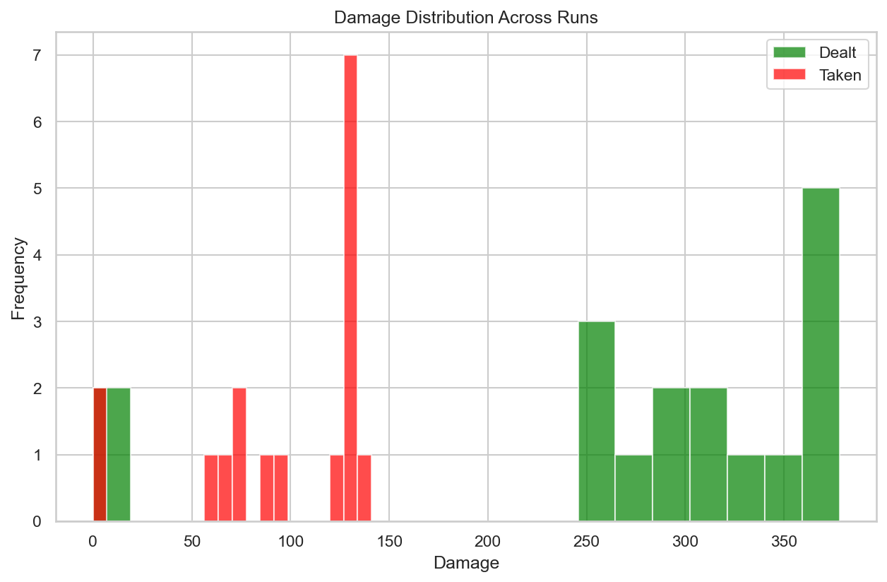
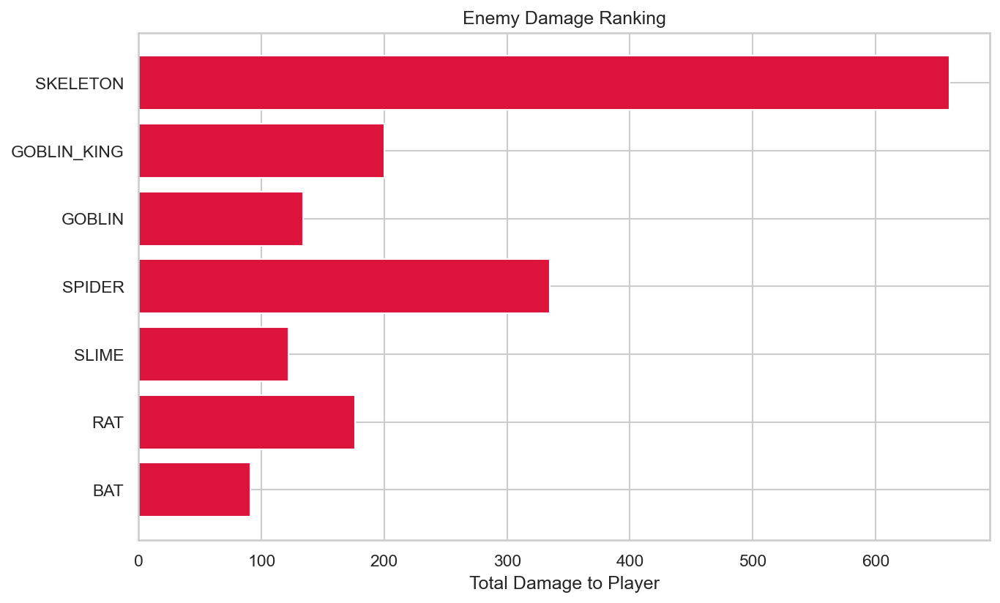
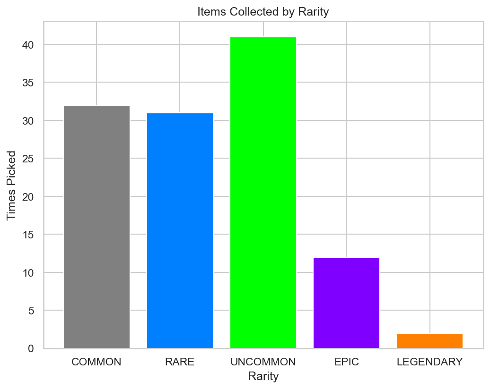

# RogueLab Batch Analysis Report

## Overview

| Metric | Value |
|--------|-------|
| Total Runs | 17 |
| Victories | 6 (35.3%) |
| Defeats | 11 (64.7%) |

## Combat Statistics

| Metric | Value |
|--------|-------|
| Total Combats | 152 |
| Combat Win Rate | 94.1% |
| Avg Turns/Combat | 3.9 |
| Avg Damage Dealt | 33.3 |
| Avg Damage Taken | 11.2 |
| Critical Hit Rate | 6.9% |
| Most Dangerous Enemy | SKELETON |

## Enemy Lethality Ranking

| Enemy | Encounters | Player Deaths | Lethality |
|-------|------------|---------------|-----------|
| SKELETON | 11 | 5 | 45.45% |
| GOBLIN_KING | 8 | 2 | 25.00% |
| GOBLIN | 11 | 1 | 9.09% |
| SPIDER | 12 | 1 | 8.33% |
| SLIME | 16 | 0 | 0.00% |
| RAT | 16 | 0 | 0.00% |
| BAT | 16 | 0 | 0.00% |

## Death Causes

| Enemy | Deaths |
|-------|--------|
| SKELETON | 5 |
| GOBLIN_KING | 2 |
| SPIDER | 1 |
| GOBLIN | 1 |

## Item Statistics

| Item | Rarity | Times Picked | Win Rate |
|------|--------|--------------|----------|
| Dagger | COMMON | 5 | 25.0% |
| Superior Robes | RARE | 5 | 60.0% |
| Fine Robes | UNCOMMON | 5 | 60.0% |
| Superior Chainmail | RARE | 5 | 75.0% |
| Superior Dagger | RARE | 5 | 80.0% |
| Health Potion | COMMON | 4 | 75.0% |
| Cloak | COMMON | 4 | 75.0% |
| Fine Spear | UNCOMMON | 4 | 50.0% |
| Fine Axe | UNCOMMON | 3 | 50.0% |
| Fine Elixir | UNCOMMON | 3 | 66.7% |
| Fine Cloak | UNCOMMON | 3 | 66.7% |
| Superior Leather Armor | RARE | 3 | 66.7% |
| Sword | COMMON | 3 | 33.3% |
| Fine Dagger | UNCOMMON | 3 | 66.7% |
| Fine Leather Armor | UNCOMMON | 3 | 66.7% |

## Run Statistics

| Metric | Mean | Min | Max |
|--------|------|-----|-----|
| Floors Reached | 2.6 | 0 | 3 |
| Enemies Killed | 14.6 | 0 | 22 |
| Damage Dealt | 280 | 0 | 378 |
| Gold Earned | 236 | 0 | 460 |

## Visualizations

