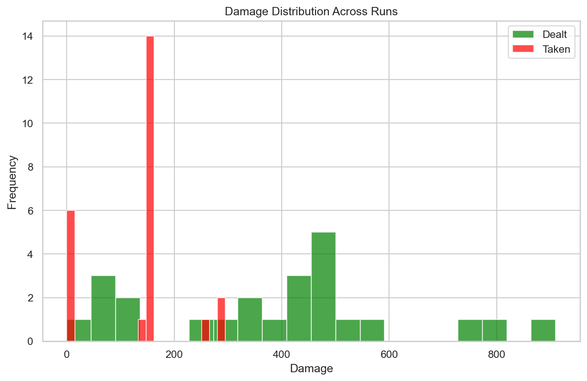
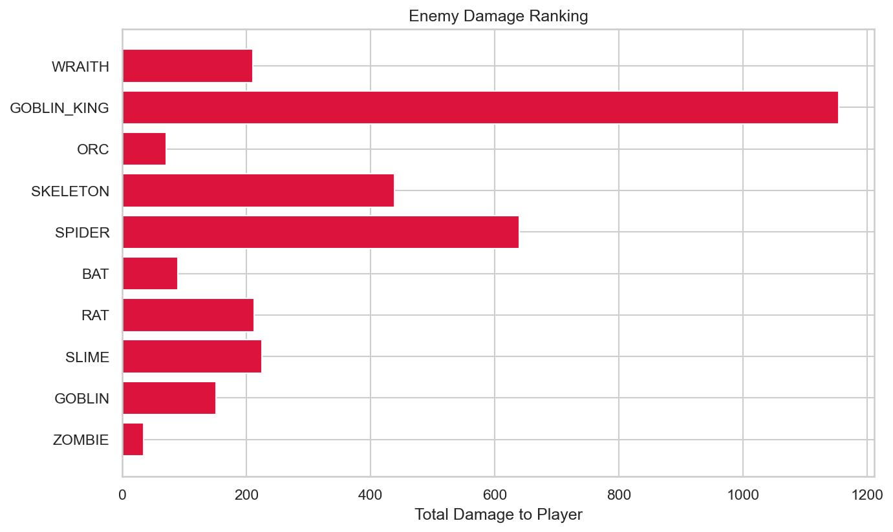
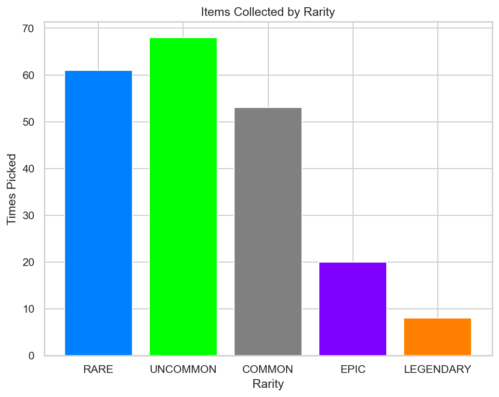

# RogueLab Batch Analysis Report

## Overview

| Metric | Value |
|--------|-------|
| Total Runs | 24 |
| Victories | 5 (20.8%) |
| Defeats | 19 (79.2%) |

## Combat Statistics

| Metric | Value |
|--------|-------|
| Total Combats | 242 |
| Combat Win Rate | 92.6% |
| Avg Turns/Combat | 4.5 |
| Avg Damage Dealt | 38.3 |
| Avg Damage Taken | 13.1 |
| Critical Hit Rate | 4.9% |
| Most Dangerous Enemy | GOBLIN_KING |

## Enemy Lethality Ranking

| Enemy | Encounters | Player Deaths | Lethality |
|-------|------------|---------------|-----------|
| WRAITH | 3 | 2 | 66.67% |
| GOBLIN_KING | 18 | 10 | 55.56% |
| ORC | 2 | 1 | 50.00% |
| SKELETON | 16 | 3 | 18.75% |
| SPIDER | 17 | 2 | 11.76% |
| BAT | 21 | 0 | 0.00% |
| RAT | 22 | 0 | 0.00% |
| SLIME | 22 | 0 | 0.00% |
| GOBLIN | 15 | 0 | 0.00% |
| ZOMBIE | 1 | 0 | 0.00% |

## Death Causes

| Enemy | Deaths |
|-------|--------|
| GOBLIN_KING | 10 |
| SKELETON | 3 |
| WRAITH | 2 |
| SPIDER | 2 |
| ORC | 1 |

## Item Statistics

| Item | Rarity | Times Picked | Win Rate |
|------|--------|--------------|----------|
| Superior Dagger | RARE | 9 | 0.0% |
| Fine Leather Armor | UNCOMMON | 8 | 12.5% |
| Dagger | COMMON | 8 | 16.7% |
| Fine Spear | UNCOMMON | 7 | 25.0% |
| Fine Robes | UNCOMMON | 7 | 28.6% |
| Superior Chainmail | RARE | 7 | 16.7% |
| Superior Leather Armor | RARE | 6 | 16.7% |
| Fine Sword | UNCOMMON | 6 | 20.0% |
| Fine Plate Armor | UNCOMMON | 6 | 0.0% |
| Fine Bracelet | UNCOMMON | 6 | 25.0% |
| Mace | COMMON | 5 | 40.0% |
| Axe | COMMON | 5 | 40.0% |
| Masterwork Plate Armor | EPIC | 5 | 20.0% |
| Superior Amulet | RARE | 4 | 25.0% |
| Sword | COMMON | 4 | 0.0% |

## Run Statistics

| Metric | Mean | Min | Max |
|--------|------|-----|-----|
| Floors Reached | 3.1 | 0 | 5 |
| Enemies Killed | 17.6 | 0 | 35 |
| Damage Dealt | 386 | 0 | 910 |
| Gold Earned | 271 | 0 | 666 |

## Visualizations

