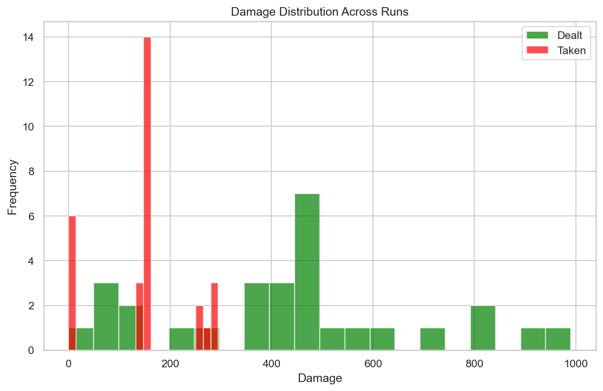
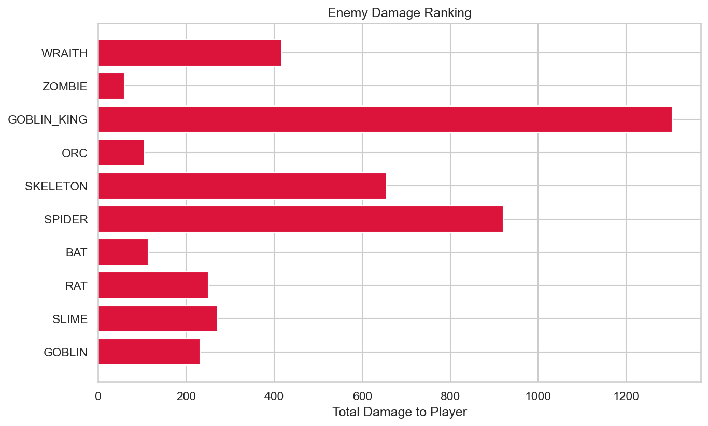
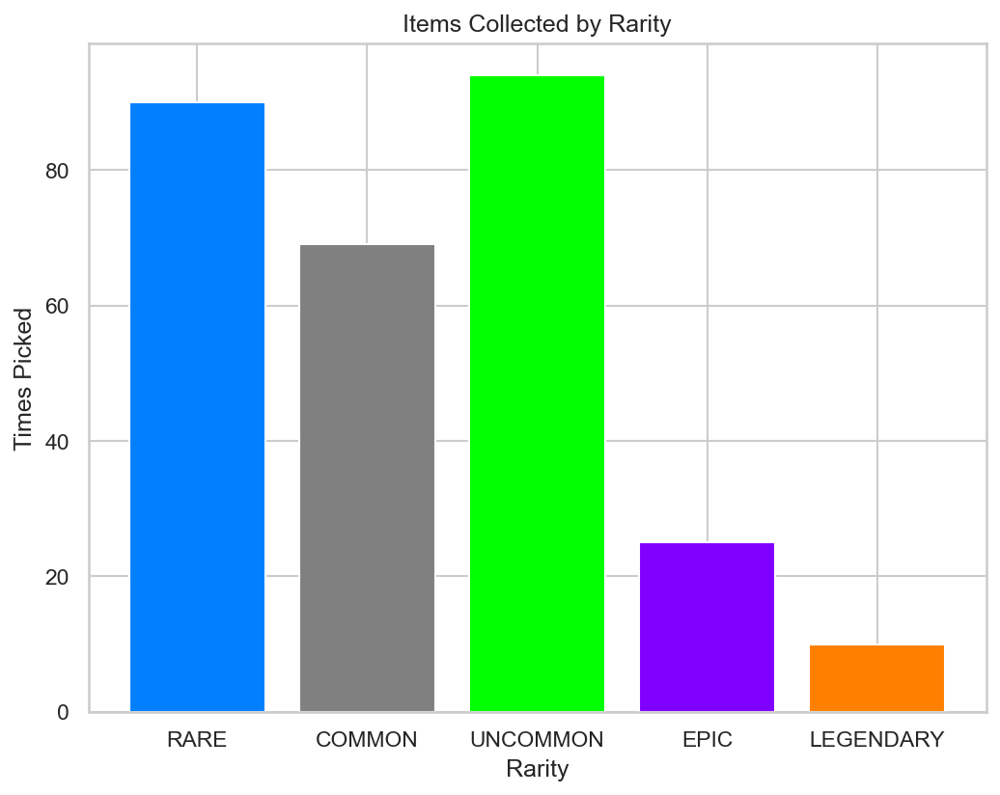

# RogueLab Batch Analysis Report

## Overview

| Metric | Value |
|--------|-------|
| Total Runs | 29 |
| Victories | 5 (17.2%) |
| Defeats | 24 (82.8%) |

## Combat Statistics

| Metric | Value |
|--------|-------|
| Total Combats | 317 |
| Combat Win Rate | 92.7% |
| Avg Turns/Combat | 4.6 |
| Avg Damage Dealt | 39.7 |
| Avg Damage Taken | 13.5 |
| Critical Hit Rate | 4.9% |
| Most Dangerous Enemy | GOBLIN_KING |

## Enemy Lethality Ranking

| Enemy | Encounters | Player Deaths | Lethality |
|-------|------------|---------------|-----------|
| WRAITH | 6 | 3 | 50.00% |
| ZOMBIE | 4 | 2 | 50.00% |
| GOBLIN_KING | 23 | 10 | 43.48% |
| ORC | 3 | 1 | 33.33% |
| SKELETON | 21 | 5 | 23.81% |
| SPIDER | 22 | 2 | 9.09% |
| BAT | 26 | 0 | 0.00% |
| RAT | 27 | 0 | 0.00% |
| SLIME | 27 | 0 | 0.00% |
| GOBLIN | 20 | 0 | 0.00% |

## Death Causes

| Enemy | Deaths |
|-------|--------|
| GOBLIN_KING | 10 |
| SKELETON | 5 |
| WRAITH | 3 |
| SPIDER | 2 |
| ZOMBIE | 2 |
| ORC | 1 |

## Item Statistics

| Item | Rarity | Times Picked | Win Rate |
|------|--------|--------------|----------|
| Superior Dagger | RARE | 11 | 0.0% |
| Superior Chainmail | RARE | 10 | 11.1% |
| Dagger | COMMON | 10 | 12.5% |
| Fine Spear | UNCOMMON | 9 | 16.7% |
| Fine Leather Armor | UNCOMMON | 9 | 11.1% |
| Fine Sword | UNCOMMON | 9 | 12.5% |
| Superior Robes | RARE | 9 | 0.0% |
| Superior Leather Armor | RARE | 8 | 12.5% |
| Fine Robes | UNCOMMON | 8 | 25.0% |
| Axe | COMMON | 7 | 28.6% |
| Fine Plate Armor | UNCOMMON | 7 | 0.0% |
| Masterwork Plate Armor | EPIC | 6 | 16.7% |
| Superior Plate Armor | RARE | 6 | 0.0% |
| Fine Bracelet | UNCOMMON | 6 | 25.0% |
| Fine Chainmail | UNCOMMON | 6 | 25.0% |

## Run Statistics

| Metric | Mean | Min | Max |
|--------|------|-----|-----|
| Floors Reached | 3.4 | 0 | 5 |
| Enemies Killed | 19.1 | 0 | 40 |
| Damage Dealt | 434 | 0 | 990 |
| Gold Earned | 323 | 0 | 727 |

## Visualizations

