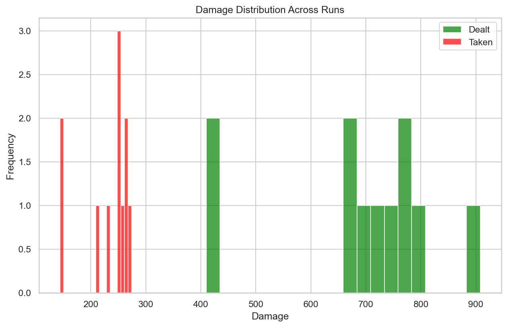
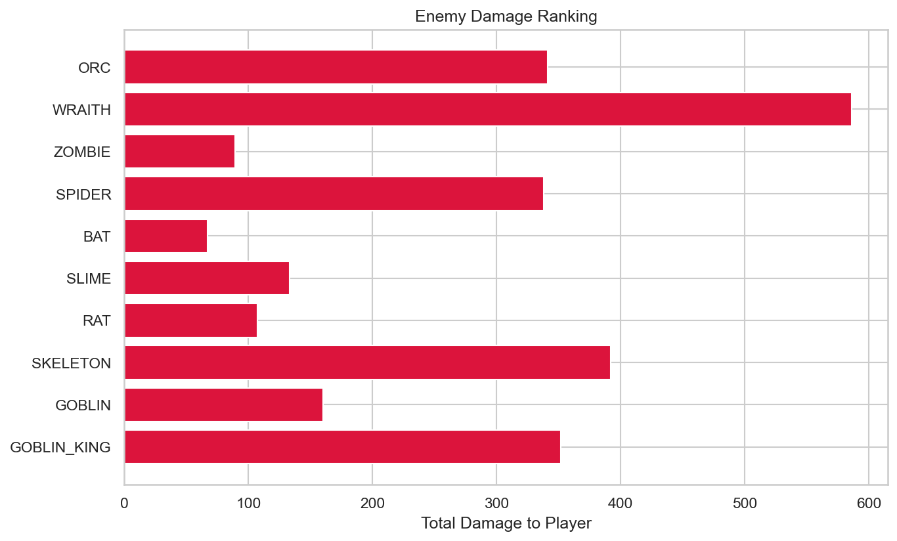
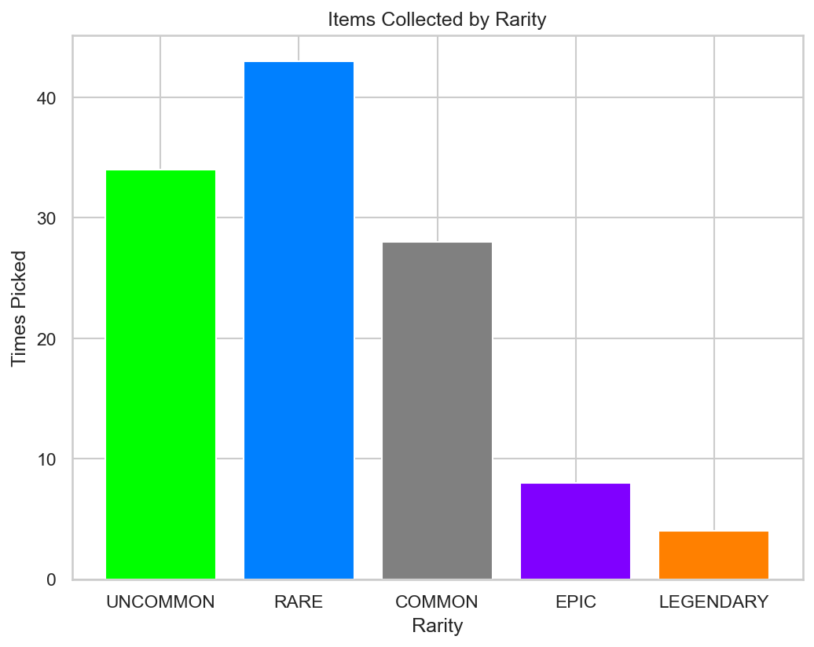

# RogueLab Batch Analysis Report

## Overview

| Metric | Value |
|--------|-------|
| Total Runs | 11 |
| Victories | 0 (0.0%) |
| Defeats | 11 (100.0%) |

## Combat Statistics

| Metric | Value |
|--------|-------|
| Total Combats | 166 |
| Combat Win Rate | 93.4% |
| Avg Turns/Combat | 5.3 |
| Avg Damage Dealt | 45.8 |
| Avg Damage Taken | 15.3 |
| Critical Hit Rate | 4.9% |
| Most Dangerous Enemy | WRAITH |

## Enemy Lethality Ranking

| Enemy | Encounters | Player Deaths | Lethality |
|-------|------------|---------------|-----------|
| ORC | 9 | 6 | 66.67% |
| WRAITH | 8 | 2 | 25.00% |
| ZOMBIE | 9 | 2 | 22.22% |
| SPIDER | 11 | 1 | 9.09% |
| BAT | 11 | 0 | 0.00% |
| SLIME | 11 | 0 | 0.00% |
| RAT | 11 | 0 | 0.00% |
| SKELETON | 11 | 0 | 0.00% |
| GOBLIN | 11 | 0 | 0.00% |
| GOBLIN_KING | 11 | 0 | 0.00% |

## Death Causes

| Enemy | Deaths |
|-------|--------|
| ORC | 6 |
| WRAITH | 2 |
| ZOMBIE | 2 |
| SPIDER | 1 |

## Item Statistics

| Item | Rarity | Times Picked | Win Rate |
|------|--------|--------------|----------|
| Fine Plate Armor | UNCOMMON | 6 | 0.0% |
| Fine Mace | UNCOMMON | 5 | 0.0% |
| Fine Dagger | UNCOMMON | 5 | 0.0% |
| Superior Mace | RARE | 5 | 0.0% |
| Superior Dagger | RARE | 5 | 0.0% |
| Superior Leather Armor | RARE | 5 | 0.0% |
| Robes | COMMON | 4 | 0.0% |
| Superior Healing Salve | RARE | 4 | 0.0% |
| Fine Spear | UNCOMMON | 4 | 0.0% |
| Axe | COMMON | 3 | 0.0% |
| Superior Robes | RARE | 3 | 0.0% |
| Healing Salve | COMMON | 3 | 0.0% |
| Fine Robes | UNCOMMON | 3 | 0.0% |
| Superior Amulet | RARE | 3 | 0.0% |
| Leather Armor | COMMON | 3 | 0.0% |

## Run Statistics

| Metric | Mean | Min | Max |
|--------|------|-----|-----|
| Floors Reached | 4.9 | 4 | 5 |
| Enemies Killed | 28.2 | 17 | 42 |
| Damage Dealt | 691 | 410 | 908 |
| Gold Earned | 581 | 444 | 719 |

## Visualizations

