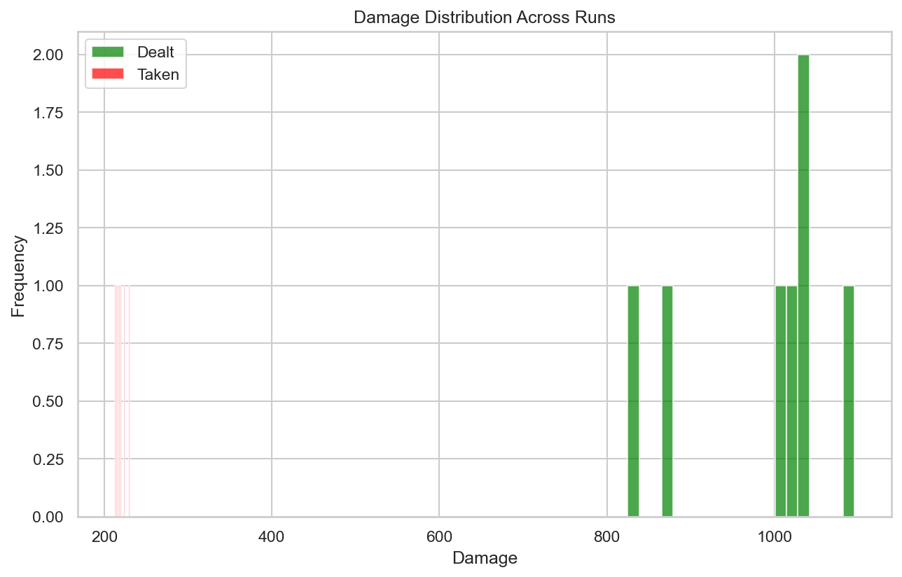
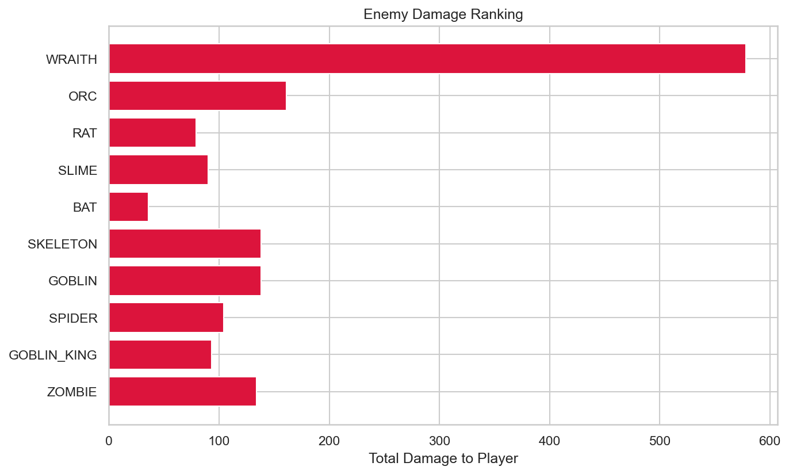
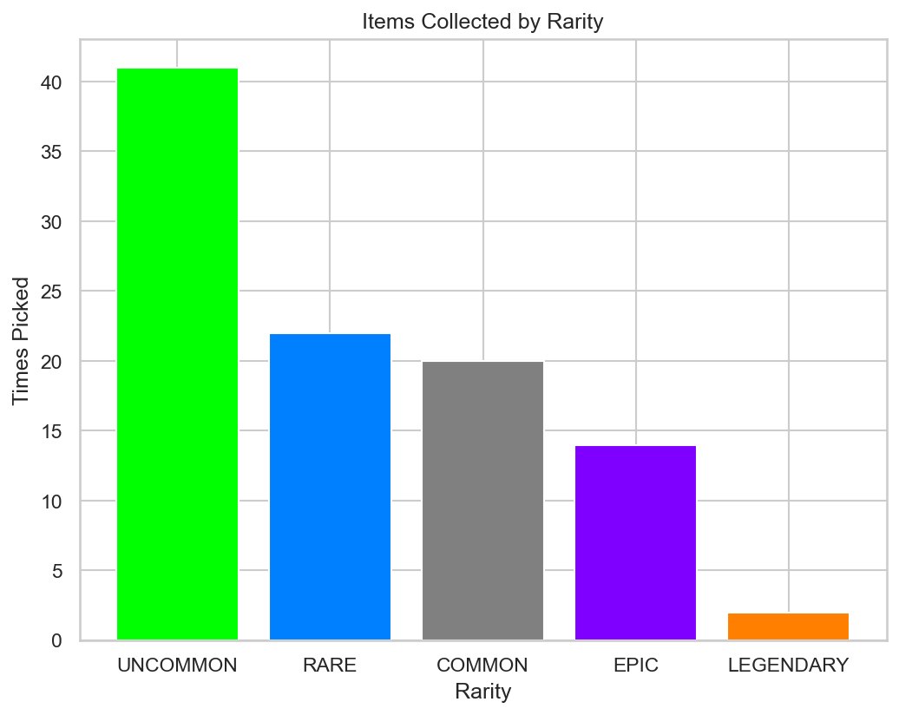

# RogueLab Batch Analysis Report

## Overview

| Metric | Value |
|--------|-------|
| Total Runs | 7 |
| Victories | 0 (0.0%) |
| Defeats | 7 (100.0%) |

## Combat Statistics

| Metric | Value |
|--------|-------|
| Total Combats | 142 |
| Combat Win Rate | 95.1% |
| Avg Turns/Combat | 5.6 |
| Avg Damage Dealt | 48.4 |
| Avg Damage Taken | 10.8 |
| Critical Hit Rate | 5.4% |
| Most Dangerous Enemy | WRAITH |

## Enemy Lethality Ranking

| Enemy | Encounters | Player Deaths | Lethality |
|-------|------------|---------------|-----------|
| WRAITH | 7 | 5 | 71.43% |
| ORC | 7 | 2 | 28.57% |
| RAT | 5 | 0 | 0.00% |
| SLIME | 7 | 0 | 0.00% |
| BAT | 7 | 0 | 0.00% |
| SKELETON | 7 | 0 | 0.00% |
| GOBLIN | 7 | 0 | 0.00% |
| SPIDER | 7 | 0 | 0.00% |
| GOBLIN_KING | 7 | 0 | 0.00% |
| ZOMBIE | 6 | 0 | 0.00% |

## Death Causes

| Enemy | Deaths |
|-------|--------|
| WRAITH | 5 |
| ORC | 2 |

## Item Statistics

| Item | Rarity | Times Picked | Win Rate |
|------|--------|--------------|----------|
| Fine Sword | UNCOMMON | 6 | 0.0% |
| Fine Spear | UNCOMMON | 6 | 0.0% |
| Fine Mace | UNCOMMON | 5 | 0.0% |
| Superior Axe | RARE | 5 | 0.0% |
| Fine Plate Armor | UNCOMMON | 4 | 0.0% |
| Dagger | COMMON | 4 | 0.0% |
| Fine Leather Armor | UNCOMMON | 3 | 0.0% |
| Fine Health Potion | UNCOMMON | 3 | 0.0% |
| Superior Chainmail | RARE | 3 | 0.0% |
| Leather Armor | COMMON | 3 | 0.0% |
| Fine Bracelet | UNCOMMON | 2 | 0.0% |
| Robes | COMMON | 2 | 0.0% |
| Cloak | COMMON | 2 | 0.0% |
| Fine Chainmail | UNCOMMON | 2 | 0.0% |
| Masterwork Chainmail | EPIC | 2 | 0.0% |

## Run Statistics

| Metric | Mean | Min | Max |
|--------|------|-----|-----|
| Floors Reached | 5.4 | 5 | 6 |
| Enemies Killed | 38.0 | 32 | 45 |
| Damage Dealt | 982 | 825 | 1096 |
| Gold Earned | 744 | 660 | 824 |

## Visualizations

