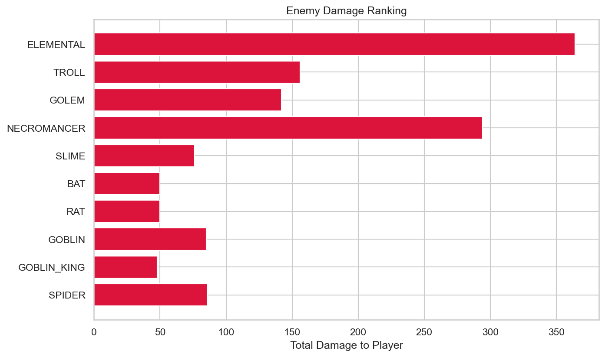

# RogueLab Batch Analysis Report

## Overview

| Metric | Value |
|--------|-------|
| Total Runs | 9 |
| Victories | 0 (0.0%) |
| Defeats | 9 (100.0%) |

## Combat Statistics

| Metric | Value |
|--------|-------|
| Total Combats | 190 |
| Combat Win Rate | 95.8% |
| Avg Turns/Combat | 6.4 |
| Avg Damage Dealt | 58.5 |
| Avg Damage Taken | 10.2 |
| Critical Hit Rate | 5.6% |
| Most Dangerous Enemy | ELEMENTAL |

## Enemy Lethality Ranking

| Enemy | Encounters | Player Deaths | Lethality |
|-------|------------|---------------|-----------|
| ELEMENTAL | 7 | 4 | 57.14% |
| TROLL | 5 | 2 | 40.00% |
| GOLEM | 6 | 1 | 16.67% |
| NECROMANCER | 8 | 1 | 12.50% |
| SLIME | 8 | 0 | 0.00% |
| BAT | 8 | 0 | 0.00% |
| RAT | 8 | 0 | 0.00% |
| GOBLIN | 8 | 0 | 0.00% |
| GOBLIN_KING | 8 | 0 | 0.00% |
| SPIDER | 8 | 0 | 0.00% |

## Death Causes

| Enemy | Deaths |
|-------|--------|
| ELEMENTAL | 4 |
| TROLL | 2 |
| GOLEM | 1 |
| NECROMANCER | 1 |

## Item Statistics

| Item | Rarity | Times Picked | Win Rate |
|------|--------|--------------|----------|
| Fine Plate Armor | UNCOMMON | 8 | 0.0% |
| Superior Chainmail | RARE | 7 | 0.0% |
| Fine Mace | UNCOMMON | 6 | 0.0% |
| Fine Spear | UNCOMMON | 6 | 0.0% |
| Fine Sword | UNCOMMON | 6 | 0.0% |
| Superior Spear | RARE | 6 | 0.0% |
| Superior Mace | RARE | 6 | 0.0% |
| Superior Plate Armor | RARE | 6 | 0.0% |
| Superior Sword | RARE | 5 | 0.0% |
| Superior Dagger | RARE | 5 | 0.0% |
| Fine Ring | UNCOMMON | 5 | 0.0% |
| Fine Robes | UNCOMMON | 5 | 0.0% |
| Fine Elixir | UNCOMMON | 5 | 0.0% |
| Fine Leather Armor | UNCOMMON | 5 | 0.0% |
| Superior Leather Armor | RARE | 5 | 0.0% |

## Run Statistics

| Metric | Mean | Min | Max |
|--------|------|-----|-----|
| Floors Reached | 6.4 | 0 | 8 |
| Enemies Killed | 39.3 | 0 | 57 |
| Damage Dealt | 1235 | 0 | 2017 |
| Gold Earned | 1123 | 0 | 1573 |

## Visualizations

