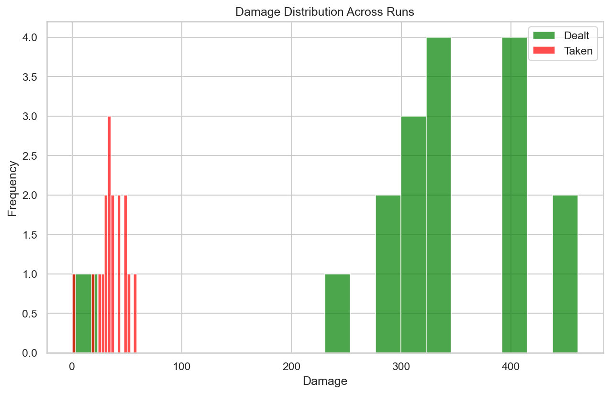
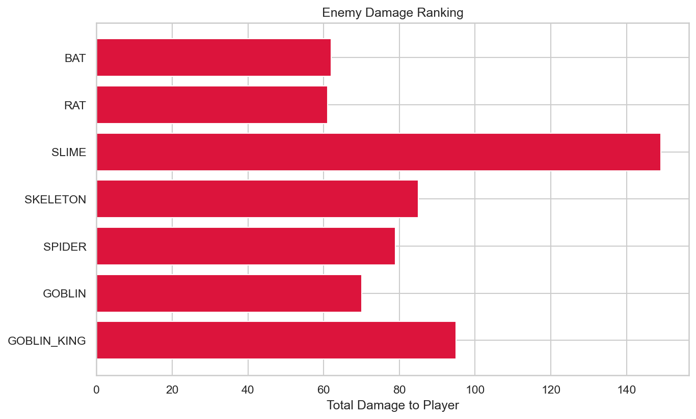
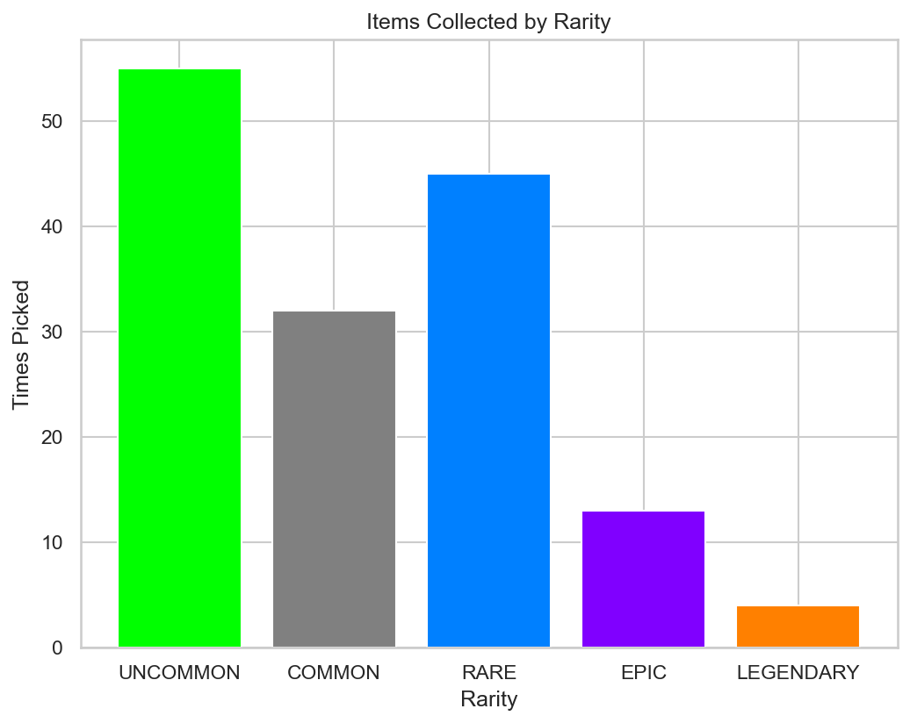

# RogueLab Batch Analysis Report

## Overview

| Metric | Value |
|--------|-------|
| Total Runs | 17 |
| Victories | 16 (94.1%) |
| Defeats | 1 (5.9%) |

## Combat Statistics

| Metric | Value |
|--------|-------|
| Total Combats | 173 |
| Combat Win Rate | 100.0% |
| Avg Turns/Combat | 3.5 |
| Avg Damage Dealt | 32.4 |
| Avg Damage Taken | 3.5 |
| Critical Hit Rate | 5.3% |
| Most Dangerous Enemy | SLIME |

## Enemy Lethality Ranking

| Enemy | Encounters | Player Deaths | Lethality |
|-------|------------|---------------|-----------|
| BAT | 16 | 0 | 0.00% |
| RAT | 15 | 0 | 0.00% |
| SLIME | 16 | 0 | 0.00% |
| SKELETON | 15 | 0 | 0.00% |
| SPIDER | 13 | 0 | 0.00% |
| GOBLIN | 14 | 0 | 0.00% |
| GOBLIN_KING | 16 | 0 | 0.00% |

## Death Causes

| Enemy | Deaths |
|-------|--------|

## Item Statistics

| Item | Rarity | Times Picked | Win Rate |
|------|--------|--------------|----------|
| Fine Robes | UNCOMMON | 8 | 100.0% |
| Axe | COMMON | 8 | 100.0% |
| Fine Plate Armor | UNCOMMON | 5 | 100.0% |
| Superior Robes | RARE | 5 | 100.0% |
| Fine Elixir | UNCOMMON | 5 | 100.0% |
| Superior Spear | RARE | 5 | 100.0% |
| Fine Dagger | UNCOMMON | 4 | 100.0% |
| Superior Axe | RARE | 4 | 100.0% |
| Superior Chainmail | RARE | 4 | 100.0% |
| Superior Dagger | RARE | 4 | 100.0% |
| Superior Mace | RARE | 4 | 100.0% |
| Fine Amulet | UNCOMMON | 4 | 100.0% |
| Plate Armor | COMMON | 4 | 100.0% |
| Fine Sword | UNCOMMON | 4 | 100.0% |
| Fine Cloak | UNCOMMON | 4 | 100.0% |

## Run Statistics

| Metric | Mean | Min | Max |
|--------|------|-----|-----|
| Floors Reached | 2.8 | 0 | 3 |
| Enemies Killed | 19.5 | 0 | 28 |
| Damage Dealt | 330 | 0 | 461 |
| Gold Earned | 436 | 0 | 538 |

## Visualizations

