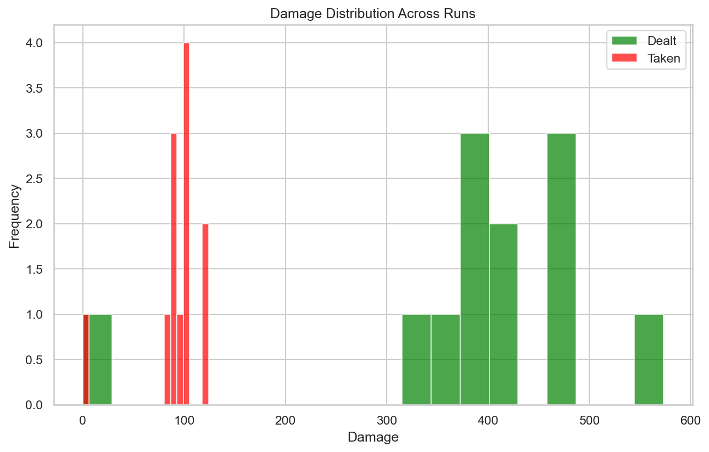
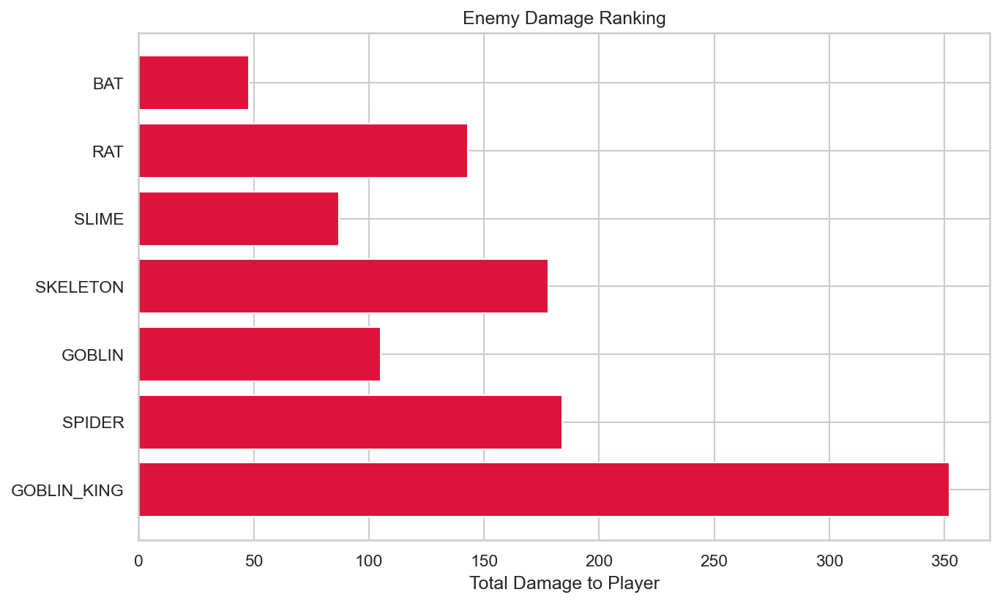
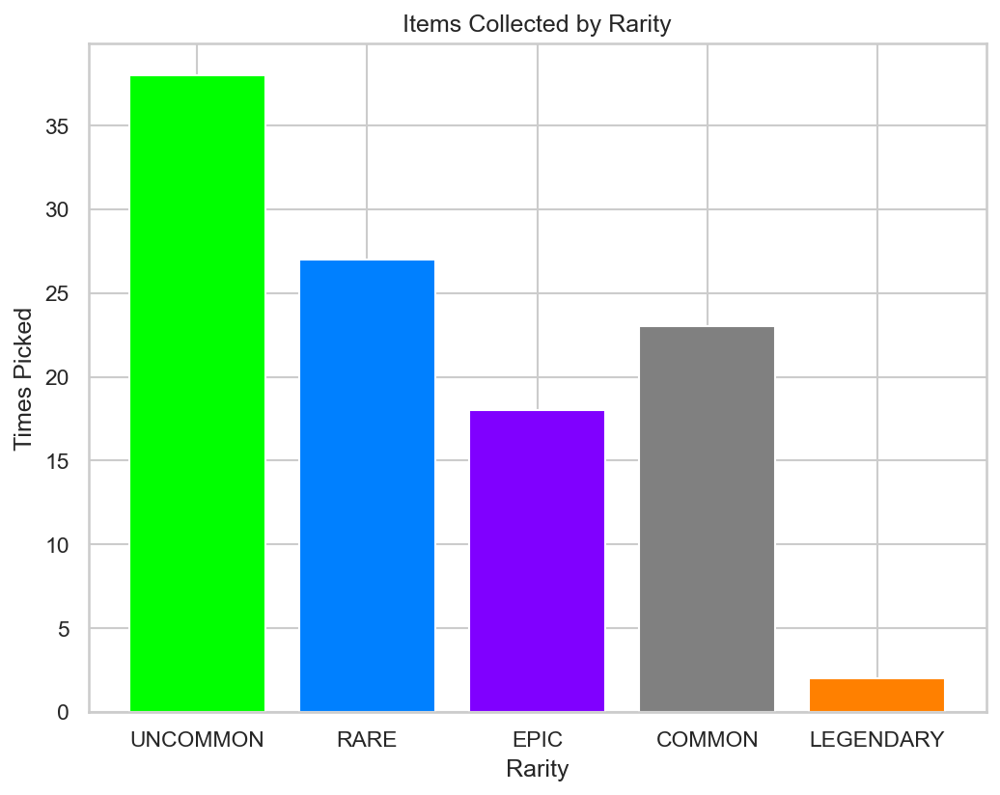

# RogueLab Batch Analysis Report

## Overview

| Metric | Value |
|--------|-------|
| Total Runs | 12 |
| Victories | 11 (91.7%) |
| Defeats | 1 (8.3%) |

## Combat Statistics

| Metric | Value |
|--------|-------|
| Total Combats | 117 |
| Combat Win Rate | 100.0% |
| Avg Turns/Combat | 4.8 |
| Avg Damage Dealt | 39.8 |
| Avg Damage Taken | 9.4 |
| Critical Hit Rate | 5.5% |
| Most Dangerous Enemy | GOBLIN_KING |

## Enemy Lethality Ranking

| Enemy | Encounters | Player Deaths | Lethality |
|-------|------------|---------------|-----------|
| BAT | 11 | 0 | 0.00% |
| RAT | 11 | 0 | 0.00% |
| SLIME | 11 | 0 | 0.00% |
| SKELETON | 9 | 0 | 0.00% |
| GOBLIN | 10 | 0 | 0.00% |
| SPIDER | 9 | 0 | 0.00% |
| GOBLIN_KING | 11 | 0 | 0.00% |

## Death Causes

| Enemy | Deaths |
|-------|--------|

## Item Statistics

| Item | Rarity | Times Picked | Win Rate |
|------|--------|--------------|----------|
| Fine Healing Salve | UNCOMMON | 5 | 100.0% |
| Superior Dagger | RARE | 4 | 100.0% |
| Fine Robes | UNCOMMON | 4 | 100.0% |
| Superior Health Potion | RARE | 4 | 100.0% |
| Superior Elixir | RARE | 3 | 100.0% |
| Fine Axe | UNCOMMON | 3 | 100.0% |
| Fine Health Potion | UNCOMMON | 3 | 100.0% |
| Fine Spear | UNCOMMON | 3 | 100.0% |
| Masterwork Chainmail | EPIC | 3 | 100.0% |
| Superior Mace | RARE | 3 | 100.0% |
| Fine Leather Armor | UNCOMMON | 3 | 100.0% |
| Fine Ring | UNCOMMON | 2 | 100.0% |
| Superior Axe | RARE | 2 | 100.0% |
| Superior Leather Armor | RARE | 2 | 100.0% |
| Health Potion | COMMON | 2 | 100.0% |

## Run Statistics

| Metric | Mean | Min | Max |
|--------|------|-----|-----|
| Floors Reached | 2.8 | 0 | 3 |
| Enemies Killed | 18.8 | 0 | 29 |
| Damage Dealt | 388 | 0 | 573 |
| Gold Earned | 423 | 0 | 543 |

## Visualizations

