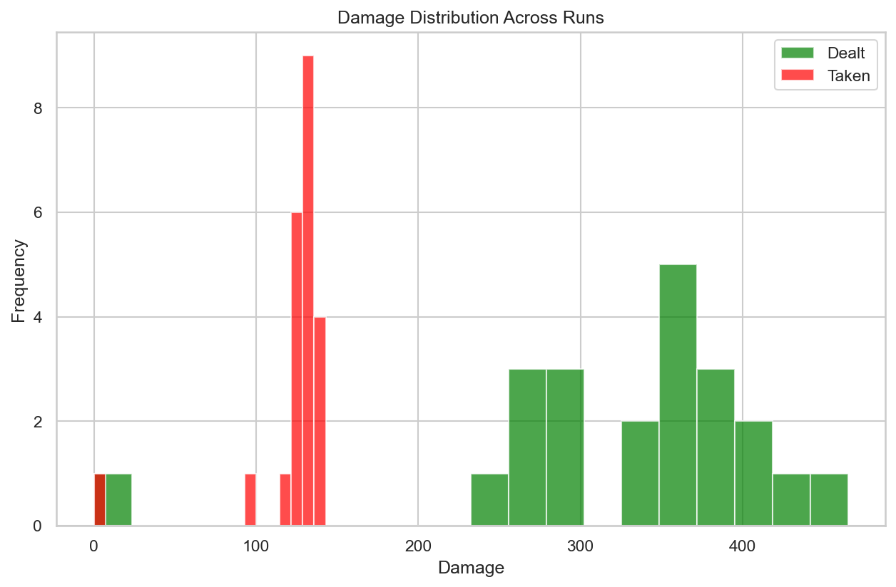
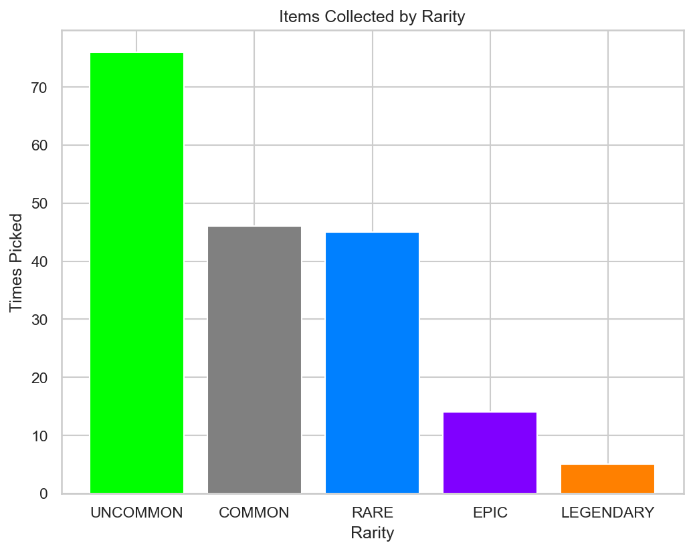

# RogueLab Batch Analysis Report

## Overview

| Metric | Value |
|--------|-------|
| Total Runs | 22 |
| Victories | 3 (13.6%) |
| Defeats | 19 (86.4%) |

## Combat Statistics

| Metric | Value |
|--------|-------|
| Total Combats | 214 |
| Combat Win Rate | 91.6% |
| Avg Turns/Combat | 4.0 |
| Avg Damage Dealt | 33.8 |
| Avg Damage Taken | 12.7 |
| Critical Hit Rate | 4.2% |
| Most Dangerous Enemy | SKELETON |

## Enemy Lethality Ranking

| Enemy | Encounters | Player Deaths | Lethality |
|-------|------------|---------------|-----------|
| GOBLIN_KING | 14 | 11 | 78.57% |
| SPIDER | 20 | 4 | 20.00% |
| SKELETON | 18 | 3 | 16.67% |
| SLIME | 21 | 0 | 0.00% |
| RAT | 21 | 0 | 0.00% |
| BAT | 21 | 0 | 0.00% |
| GOBLIN | 16 | 0 | 0.00% |

## Death Causes

| Enemy | Deaths |
|-------|--------|
| GOBLIN_KING | 11 |
| SPIDER | 4 |
| SKELETON | 3 |

## Item Statistics

| Item | Rarity | Times Picked | Win Rate |
|------|--------|--------------|----------|
| Fine Spear | UNCOMMON | 10 | 20.0% |
| Fine Sword | UNCOMMON | 7 | 16.7% |
| Fine Mace | UNCOMMON | 7 | 0.0% |
| Fine Leather Armor | UNCOMMON | 6 | 0.0% |
| Amulet | COMMON | 6 | 16.7% |
| Fine Chainmail | UNCOMMON | 6 | 33.3% |
| Fine Dagger | UNCOMMON | 6 | 0.0% |
| Superior Plate Armor | RARE | 6 | 20.0% |
| Superior Elixir | RARE | 5 | 50.0% |
| Sword | COMMON | 5 | 0.0% |
| Superior Ring | RARE | 5 | 50.0% |
| Superior Chainmail | RARE | 4 | 33.3% |
| Superior Mace | RARE | 4 | 25.0% |
| Fine Plate Armor | UNCOMMON | 4 | 50.0% |
| Plate Armor | COMMON | 4 | 0.0% |

## Run Statistics

| Metric | Mean | Min | Max |
|--------|------|-----|-----|
| Floors Reached | 2.9 | 0 | 3 |
| Enemies Killed | 17.4 | 0 | 27 |
| Damage Dealt | 328 | 0 | 465 |
| Gold Earned | 214 | 0 | 432 |

## Visualizations

