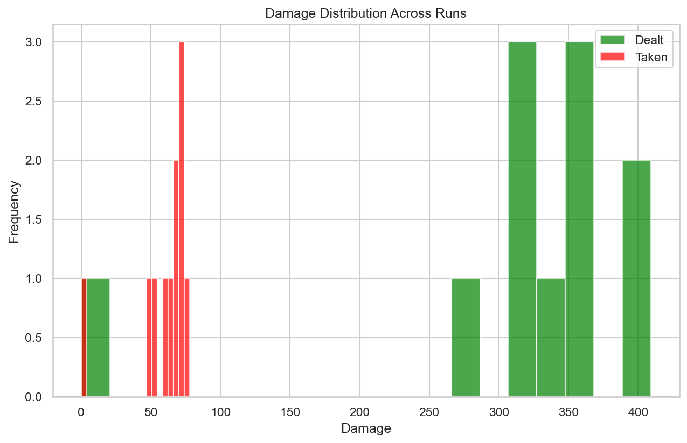
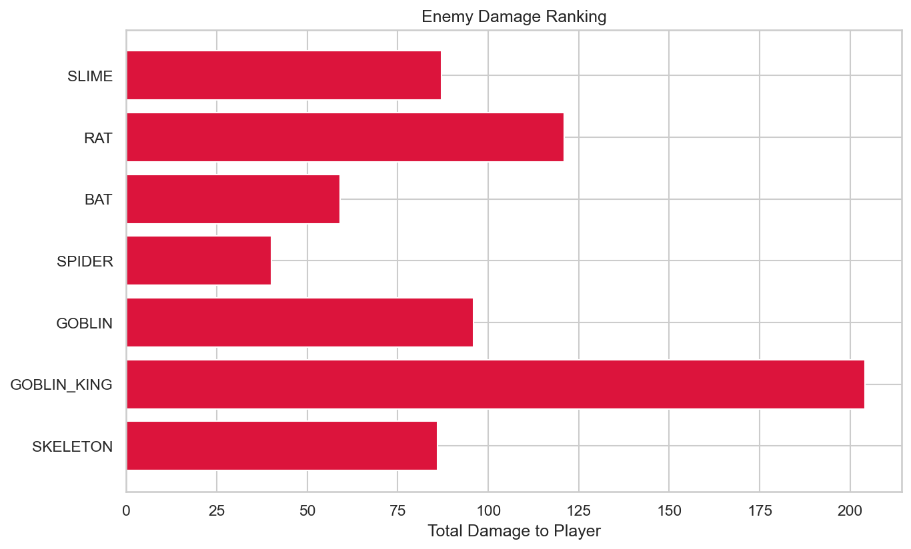
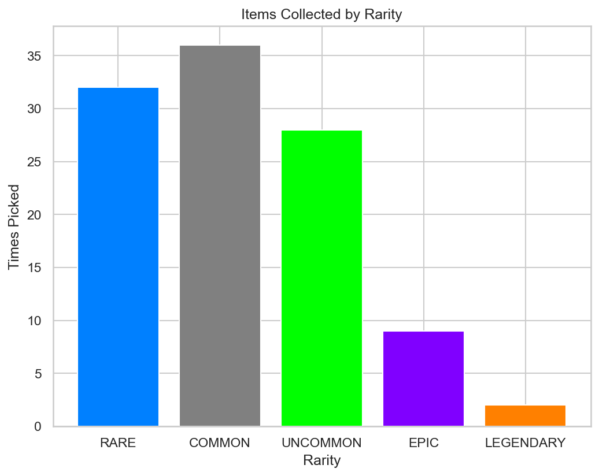

# RogueLab Batch Analysis Report

## Overview

| Metric | Value |
|--------|-------|
| Total Runs | 11 |
| Victories | 10 (90.9%) |
| Defeats | 1 (9.1%) |

## Combat Statistics

| Metric | Value |
|--------|-------|
| Total Combats | 108 |
| Combat Win Rate | 100.0% |
| Avg Turns/Combat | 3.9 |
| Avg Damage Dealt | 33.6 |
| Avg Damage Taken | 6.4 |
| Critical Hit Rate | 6.9% |
| Most Dangerous Enemy | GOBLIN_KING |

## Enemy Lethality Ranking

| Enemy | Encounters | Player Deaths | Lethality |
|-------|------------|---------------|-----------|
| SLIME | 11 | 0 | 0.00% |
| RAT | 11 | 0 | 0.00% |
| BAT | 11 | 0 | 0.00% |
| SPIDER | 8 | 0 | 0.00% |
| GOBLIN | 9 | 0 | 0.00% |
| GOBLIN_KING | 10 | 0 | 0.00% |
| SKELETON | 6 | 0 | 0.00% |

## Death Causes

| Enemy | Deaths |
|-------|--------|

## Item Statistics

| Item | Rarity | Times Picked | Win Rate |
|------|--------|--------------|----------|
| Superior Dagger | RARE | 5 | 100.0% |
| Spear | COMMON | 5 | 100.0% |
| Fine Leather Armor | UNCOMMON | 4 | 75.0% |
| Masterwork Robes | EPIC | 4 | 100.0% |
| Plate Armor | COMMON | 4 | 100.0% |
| Superior Leather Armor | RARE | 4 | 100.0% |
| Superior Dragon Scale | RARE | 4 | 100.0% |
| Superior Axe | RARE | 4 | 100.0% |
| Health Potion | COMMON | 3 | 100.0% |
| Axe | COMMON | 3 | 100.0% |
| Fine Bracelet | UNCOMMON | 3 | 66.7% |
| Robes | COMMON | 3 | 100.0% |
| Fine Healing Salve | UNCOMMON | 3 | 100.0% |
| Dagger | COMMON | 3 | 100.0% |
| Elixir | COMMON | 3 | 100.0% |

## Run Statistics

| Metric | Mean | Min | Max |
|--------|------|-----|-----|
| Floors Reached | 2.7 | 0 | 3 |
| Enemies Killed | 16.6 | 0 | 23 |
| Damage Dealt | 313 | 0 | 409 |
| Gold Earned | 390 | 0 | 477 |

## Visualizations

