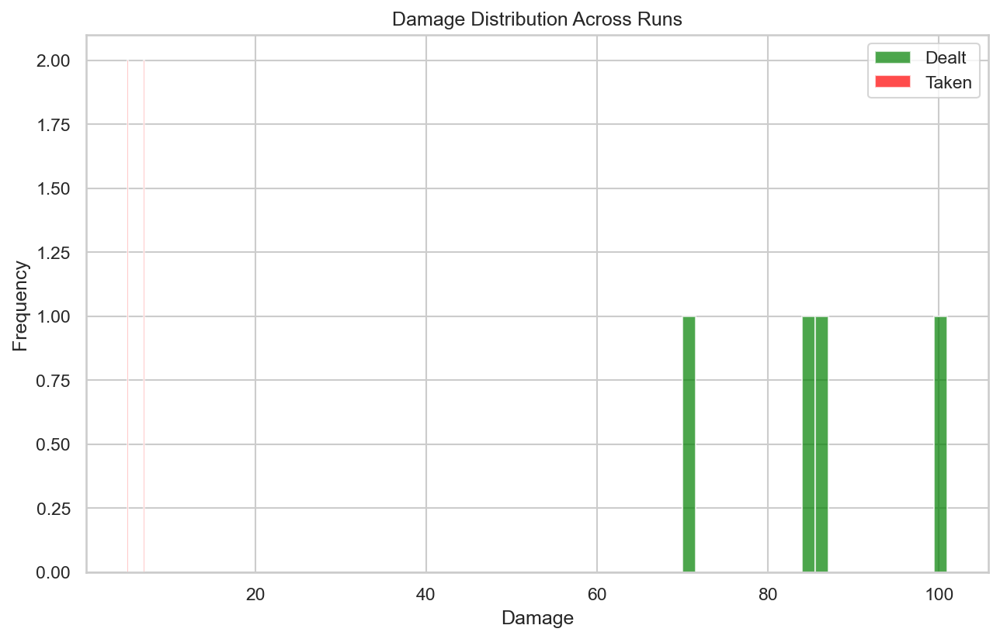
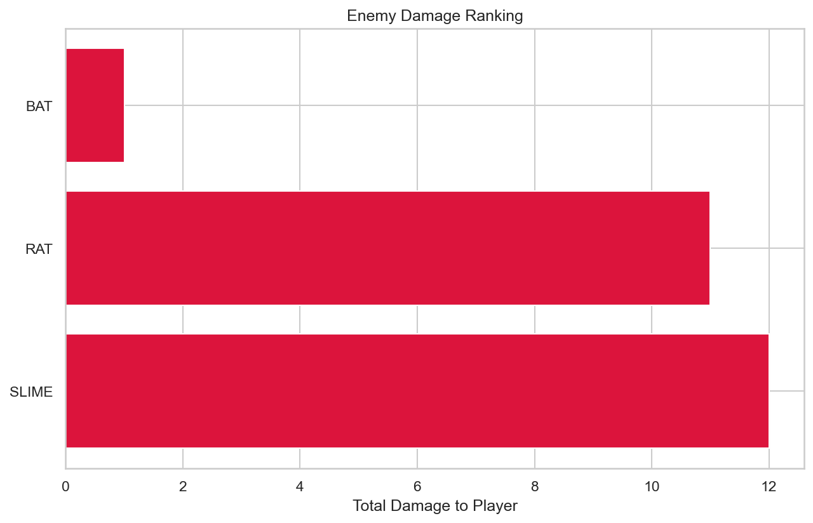
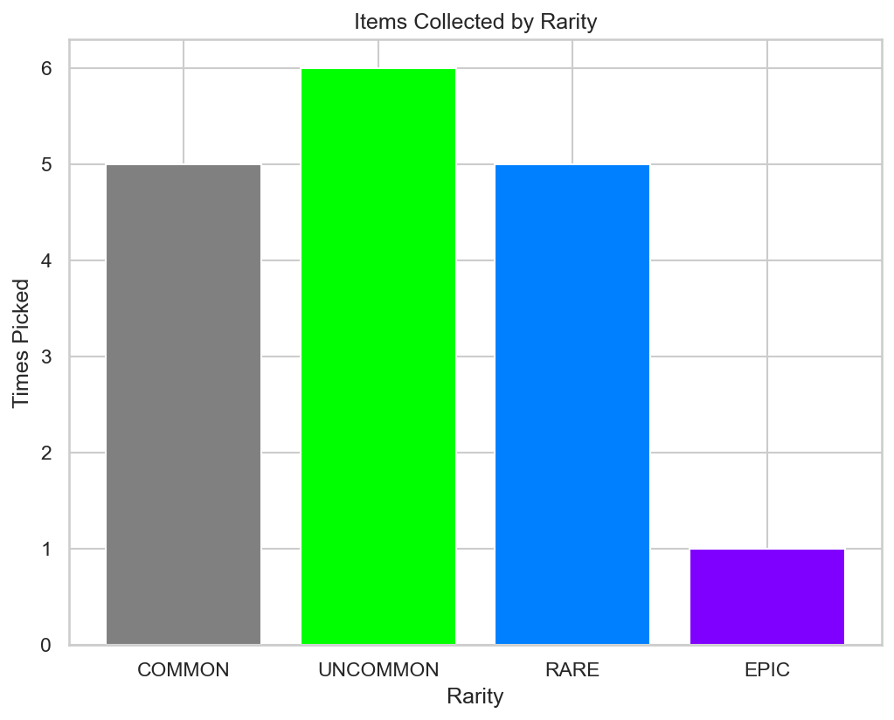

# RogueLab Batch Analysis Report

## Overview

| Metric | Value |
|--------|-------|
| Total Runs | 4 |
| Victories | 4 (100.0%) |
| Defeats | 0 (0.0%) |

## Combat Statistics

| Metric | Value |
|--------|-------|
| Total Combats | 21 |
| Combat Win Rate | 100.0% |
| Avg Turns/Combat | 2.0 |
| Avg Damage Dealt | 16.3 |
| Avg Damage Taken | 1.1 |
| Critical Hit Rate | 2.3% |
| Most Dangerous Enemy | SLIME |

## Enemy Lethality Ranking

| Enemy | Encounters | Player Deaths | Lethality |
|-------|------------|---------------|-----------|
| BAT | 4 | 0 | 0.00% |
| RAT | 3 | 0 | 0.00% |
| SLIME | 3 | 0 | 0.00% |

## Death Causes

| Enemy | Deaths |
|-------|--------|

## Item Statistics

| Item | Rarity | Times Picked | Win Rate |
|------|--------|--------------|----------|
| Mace | COMMON | 2 | 100.0% |
| Fine Robes | UNCOMMON | 2 | 100.0% |
| Axe | COMMON | 2 | 100.0% |
| Superior Ancient Relic | RARE | 2 | 100.0% |
| Superior Leather Armor | RARE | 1 | 100.0% |
| Fine Spear | UNCOMMON | 1 | 100.0% |
| Fine Leather Armor | UNCOMMON | 1 | 100.0% |
| Ring | COMMON | 1 | 100.0% |
| Superior Chainmail | RARE | 1 | 100.0% |
| Fine Sword | UNCOMMON | 1 | 100.0% |
| Masterwork Plate Armor | EPIC | 1 | 100.0% |
| Superior Amulet | RARE | 1 | 100.0% |
| Fine Axe | UNCOMMON | 1 | 100.0% |

## Run Statistics

| Metric | Mean | Min | Max |
|--------|------|-----|-----|
| Floors Reached | 2.0 | 2 | 2 |
| Enemies Killed | 6.8 | 6 | 8 |
| Damage Dealt | 86 | 70 | 101 |
| Gold Earned | 65 | 57 | 76 |

## Visualizations

